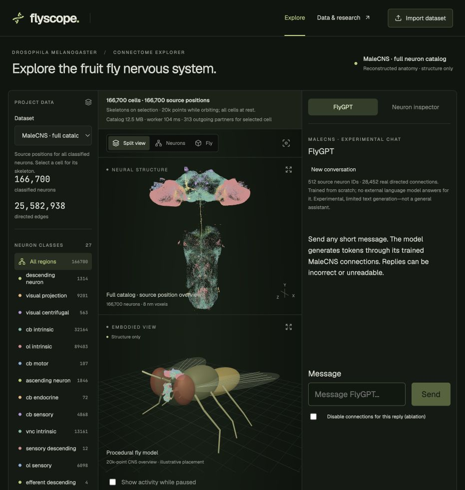

# flyscope

explore a fruit fly nervous system, run a walking simulation, and talk to a small language model built around real neural connections.

flyscope is a local react, typescript and three.js workbench for the malecns connectome. it brings the anatomy, simulated activity and body into one view. no api keys or hosted language service are needed.



*the current app with the full dataset prepared. the points are source neuron positions; the body shown here is the illustrative viewer model.*

## what you can do

- **explore the anatomy.** browse 166,700 classified neurons, filter cell classes, and select a neuron to load its detailed skeleton and outgoing connections. the prepared graph contains 25,582,938 directed weighted edges.
- **run a physical fly.** a local neuromechfly and mujoco backend couples an experimental whole-connectome rate model to a walking controller and ground-contact feedback. replay the resulting body motion and sampled neural activity on the same clock.
- **try flygpt.** the included language checkpoint generates short replies through a 512-cell malecns subgraph with 28,452 real directed connections. it was trained from scratch for next-token prediction. inference runs locally in python; mlx is used for training only.
- **bring your own experiment.** import neuron skeletons and activity, export runs, or add a controller through the documented interfaces.

## try it locally

use a recent node.js version that supports the included vite toolchain. node 22.18 or newer in the 22.x line is a suitable starting point. clone the repo, then run:

```sh
git clone https://github.com/immanuel-lam/flyscope.git
cd flyscope
npm install
npm run dev
```

open the address printed in the terminal. for a quick look without downloading the full connectome, append `/?dataset=demo` to that address. the synthetic demo and a two-neuron source sample are included in the repo.

the app selects malecns by default, but the full data files are **not included in git**. follow the [dataset setup guide](docs/LARGE_DATASETS.md) to download and prepare them. the connection download alone is about 1 gb; preparation also fetches source positions and builds local graph shards. selected skeletons load on demand.

## enable flygpt

with [uv](https://docs.astral.sh/uv/) installed, create the local python environment and install the inference dependencies:

```sh
uv venv --python 3.12 .venv-physics
uv pip install --python .venv-physics/bin/python numpy==2.5.3 tokenizers==0.23.2
```

skip the environment-creation command if you already set up physics. prepare the full dataset, start the app, and use the flygpt side panel. the checkpoint and tokenizer are included; retraining is optional.

this is a small experimental language model. replies can be unrelated, malformed or wrong. it uses general conversation training data, with no active hand-written fly q&a fine-tuning and no external model answering at runtime. the “thinking…” label means inference is running; it is not a claim that the model can reason. chat leaves the anatomy view idle instead of replaying cell states afterward.

see [the model notes](docs/FLYGPT.md) for the architecture, training data, reproduction steps and evaluation. disabling the recurrent connections increases held-out token loss from 2.74 to 6.77. that shows dependence on the wiring, not that fly wiring is better than another network.

## run the walking simulation

prepare the full dataset and install uv, then run:

```sh
npm run setup:physics
npm run dev
```

in the malecns view, select **run physics**, wait for the calculation, then use **play** or the time slider. compare normal runs with the silence and contact-feedback controls. these are computed recordings, not a live interactive physics loop.

see [the physics guide](docs/PHYSICAL_FLY.md) for dependencies, assumptions and measured controls. the setup has been tested locally on apple silicon; other platforms have not been verified.

## what is real, and what is a model?

malecns supplies the reconstructed anatomy and connections. it does **not** supply measured firing activity, language abilities or a ready-to-run nervous system.

the neural dynamics, text interfaces and motor mappings here are engineering choices. the physics model simulates contacts and movement, but its neural controller is not biologically validated. the language model uses a selected subgraph, not all 166,700 cells. activity values are continuous model states, not measured spikes. placing the whole nervous system inside the illustrated fly head is a visual aid, not anatomical registration.

vision and navigation, odour tracking, obstacle avoidance, and learning and memory are planned experiments. they are not working features yet. the [experiment roadmap](docs/EXPERIMENT_ROADMAP.md) records the direction.

## build on it

start with the [integration guide](docs/AGENT_INTEGRATION.md) and [dataset format](docs/DATA_FORMAT.md). agents have a separate [entry point](AGENTS.md); this readme is the project overview.

```sh
npm run new:controller -- my-experiment
npm run example:motor
npm run validate:dataset -- examples/neural-motor-run.json
```

controllers, datasets and external simulators use explicit versioned contracts. include source neuron ids, units, model assumptions and a test that shows how your experiment changes behavior. see the [external simulator guide](docs/EXTERNAL_SIMULATORS.md) for pose imports and coordinate conventions.

## checks

```sh
npm test
npx playwright install chromium
npm run test:browser
npm run build
```

some integration tests need the prepared dataset and local model or physics assets. a static build contains the frontend; chat, physics and on-demand skeleton loading still need the local server and their dependencies.

## data and credits

malecns data comes from flyem at hhmi janelia, the university of cambridge, mrc lmb and google research, under cc by 4.0. see the [source attribution](public/DATA_SOURCES.md) and [full dataset notes](docs/LARGE_DATASETS.md) for exact sources and transformations.

physical simulation uses [neuromechfly / flygym](https://github.com/NeLy-EPFL/flygym) and [mujoco](https://github.com/google-deepmind/mujoco). language training uses the synthetic everyday-conversations subset of smoltalk; its source revision and checksums are recorded with the checkpoint. see the [research notes](docs/RESEARCH.md) for background and the distinction between malecns and flywire.
