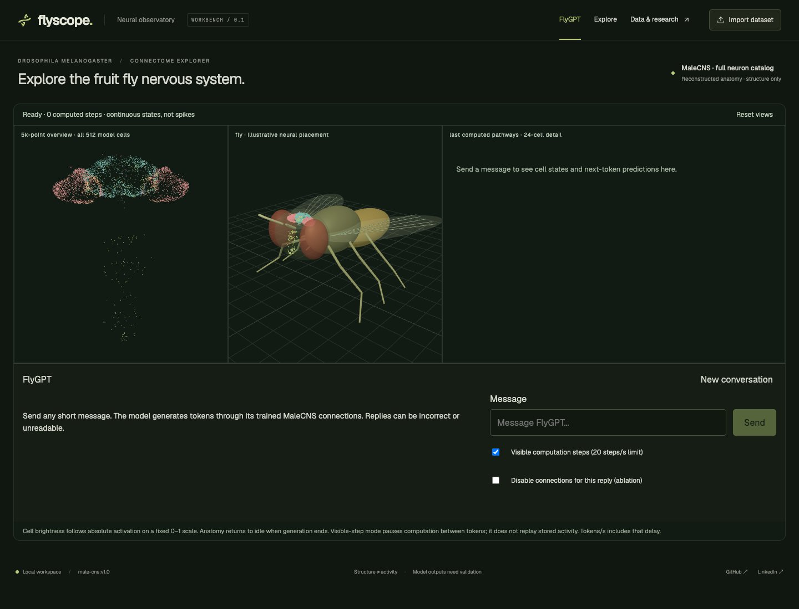

# flyscope

https://flyscope.vercel.app

explore a fruit fly nervous system, run a walking simulation, and talk to a small language model built around real neural connections.

flyscope is a local react, typescript and three.js workbench for the malecns connectome. it brings the anatomy, simulated activity and body into one view. no api keys or external language provider are needed. try the [public app](https://flyscope.vercel.app/) or run it locally.



*the dedicated flygpt workspace. the points are source neuron positions; the body is the illustrative viewer model. the physics experiments use separate neuromechfly meshes and recorded body transforms.*

## what you can do

- **explore the anatomy.** browse 166,700 classified neurons, filter cell classes, and select a neuron to load its detailed skeleton and outgoing connections. the prepared graph contains 25,582,938 directed weighted edges.
- **run a physical fly.** a local neuromechfly and mujoco backend couples an experimental whole-connectome rate model to a walking controller and ground-contact feedback. replay the resulting body motion and sampled neural activity on the same clock.
- **try flygpt.** the included language checkpoint generates short replies through a 512-cell malecns subgraph with 28,452 real directed connections. it was trained from scratch for next-token prediction. inference runs on cpu in python, locally or in the deployed function; mlx is used for training only.
- **bring your own experiment.** import neuron skeletons and activity, export runs, or add a controller through the documented interfaces.

## try it locally

use a recent node.js version that supports the included vite toolchain. node 22.18 or newer in the 22.x line is a suitable starting point. clone the repo, then run:

```sh
git clone https://github.com/immanuel-lam/flyscope.git
cd flyscope
npm install
npm run dev
```

open the address printed in the terminal. for a quick look without downloading the full connectome, append `/?dataset=demo` to that address. the synthetic demo and a two-neuron source sample are included in the repo.

the app selects malecns by default, but the full data files are **not included in git**. follow the [dataset setup guide](docs/LARGE_DATASETS.md) to download and prepare them. the connection download alone is about 1 gb; preparation also fetches source positions and builds local graph shards. selected skeletons load on demand.

## enable flygpt

with [uv](https://docs.astral.sh/uv/) installed, create the local python environment and install the inference dependencies:

```sh
uv venv --python 3.12 .venv-physics
uv pip install --python .venv-physics/bin/python numpy==2.5.3 tokenizers==0.23.2
```

skip the environment-creation command if you already set up physics. prepare the full dataset, start the app, and open the dedicated flygpt tab. the checkpoint and tokenizer are included; retraining is optional.

this is a small experimental language model. replies can be unrelated, malformed or wrong. it uses general conversation training data, with no active hand-written fly q&a fine-tuning and no external model answering at runtime. the “thinking…” label means inference is running; it is not a claim that the model can reason. the dedicated flygpt tab streams actual cell states into the point cloud, fly and circuit diagram while tokens are computed. chat returns the anatomy to idle when done. explore is reserved for anatomy. visible-step mode pauses between actual computation steps; tokens/s includes those pauses.

see [the model notes](docs/FLYGPT.md) for the architecture, training data, reproduction steps and evaluation. disabling the recurrent connections increases held-out token loss from 2.97 to 7.26. that shows dependence on the wiring, not that fly wiring is better than another network. a [three-seed comparison](docs/LANGUAGE_COMPARISON.md) found lower test loss with shuffled wiring than with the real topology.


## how the language model works

this is a recurrent language model constrained by a selected malecns graph. it is not a transformer, a pretrained assistant, or a simulation of biological language ability.

1. a byte-level tokenizer converts the conversation into ids from a 1,024-token vocabulary.
2. learned embeddings inject the current token into 128 source cells.
3. the same 512 cell states perform two recurrent updates. messages can travel only along the 28,452 retained directed source connections.
4. a learned readout takes the other 384 cells and produces next-token logits. the input and output cell sets do not overlap.
5. the runtime selects a token and feeds it back through the circuit. it stops at the end token or the output limit.

in each update, a cell retains part of its previous state and mixes in a tanh-transformed weighted input. connection strengths, biases, embeddings, retention values and readout weights are learned; the source edge mask stays fixed. there is no canned-response table or external model producing replies.

the checkpoint contains 788,480 allocated parameters, of which 554,788 are active. masked recurrent entries do not carry messages. it was trained with mlx on synthetic everyday conversations, then on 5,697 deduplicated conversation pairs. a correct prompt lowers held-out response loss compared with a mismatched prompt, but replies are still frequently irrelevant. this does **not** yet meet the standard of an intelligent general assistant. training data, state memory and model capacity all need further study; more parameters alone do not guarantee useful answers.

## inspect the weights

the model is stored in `models/malecns-chat/`:

- `runtime.npz`: portable learned arrays, with off-graph recurrent weights already zeroed.
- `manifest.json`: source cell ids, input/output indices, model assumptions, training records and weight checksum.
- `tokenizer.json`: the learned tokenizer.
- `evaluation.json` and `prompt-evaluation.json`: measured checks and unedited generated examples.

with the inference environment installed, list every array and inspect a source cell:

```sh
.venv-physics/bin/python scripts/language/inspect-weights.py
.venv-physics/bin/python scripts/language/inspect-weights.py --cell 11722 --limit 12
```

`recurrent[post, pre]` is the learned weight from the source cell to the destination cell. positive and negative values are learned model effects, not measured neurotransmitter signs. `embedding[token, input]` supplies the input; `readout[token, output]` maps output cells to logits. `retention` stores logits, so apply a sigmoid to obtain the retained fraction. the inspection command performs that conversion for you.

in the flygpt tab, node brightness shows activation magnitude, and the circuit diagram shows 24 selected cells across two updates. hover nodes and edges for values and ids. the full 512-cell network still computes. the point cloud draws a 5,000-point overview to reduce rendering work and keeps all 512 model cells in a separate activity layer. the explore tab retains the full structural overview.

## run the walking simulation

prepare the full dataset and install uv, then run:

```sh
npm run setup:physics
npm run dev
```

in the malecns view, select **run physics**, wait for the calculation, then use **play** or the time slider. compare normal runs with the silence and contact-feedback controls. these are computed recordings, not a live interactive physics loop.

see [the physics guide](docs/PHYSICAL_FLY.md) for dependencies, assumptions and measured controls. the setup has been tested locally on apple silicon; other platforms have not been verified.

## what is real, and what is a model?

malecns supplies the reconstructed anatomy and connections. it does **not** supply measured firing activity, language abilities or a ready-to-run nervous system.

the neural dynamics, text interfaces and motor mappings here are engineering choices. the physics model simulates contacts and movement, but its neural controller is not biologically validated. the language model uses a selected subgraph, not all 166,700 cells. activity values are continuous model states, not measured spikes. placing the whole nervous system inside the illustrated fly head is a visual aid, not anatomical registration.

## physical experiments

these run locally through the physics panel and record actual observations, neural states and body transforms:

- **vision:** red-target seeking from bilateral fisheye camera pixels. see the images that drove each update.
- **odour:** a defined concentration field sampled at both antennae. the display shows both signals and their steering effect.
- **obstacles:** colliding geometry and artificial head-mounted range rays. tests show reduced contact, with remaining collisions or inefficient detours in some layouts.
- **memory:** a [trained 512-cell circuit](docs/CUE_MEMORY.md) retains a brief left/right cue through a blank delay, then steers the physical fly. reset, untrained and graph-ablation controls test cue dependence. this is binary recall, not language reasoning.
- **backflip:** external lift and torque, gated by neural motor output, produce a measured rotation and landing. this is an assisted stunt, not a learned biological motor skill.

see the [physics guide](docs/PHYSICAL_FLY.md) for reproduction commands, limitations and measured controls. memory and locomotion have separate activity overlays because they are separate computational models.

## build on it

start with the [integration guide](docs/AGENT_INTEGRATION.md) and [dataset format](docs/DATA_FORMAT.md). agents have a separate [entry point](AGENTS.md); this readme is the project overview.

```sh
npm run new:controller -- my-experiment
npm run example:motor
npm run validate:dataset -- examples/neural-motor-run.json
```

controllers, datasets and external simulators use explicit versioned contracts. include source neuron ids, units, model assumptions and a test that shows how your experiment changes behavior. see the [external simulator guide](docs/EXTERNAL_SIMULATORS.md) for pose imports and coordinate conventions.

## checks

```sh
npm test
npx playwright install chromium
npm run test:browser
npm run build
```

some integration tests need the prepared dataset and generated physics recordings. the vercel deployment includes cpu chat functions, a source-skeleton proxy and pinned viewer-data downloads. physical simulations require the local python environment; they do not run on vercel. see [hosting](docs/HOSTING.md).

## data and credits

malecns data comes from flyem at hhmi janelia, the university of cambridge, mrc lmb and google research, under cc by 4.0. see the [source attribution](public/DATA_SOURCES.md) and [full dataset notes](docs/LARGE_DATASETS.md) for exact sources and transformations.

physical simulation uses [neuromechfly / flygym](https://github.com/NeLy-EPFL/flygym) and [mujoco](https://github.com/google-deepmind/mujoco). language training uses the synthetic everyday-conversations subset of smoltalk; its source revision and checksums are recorded with the checkpoint. see the [research notes](docs/RESEARCH.md) for background and the distinction between malecns and flywire.

project by [immanuel lam](https://linkedin.com/in/addimmanuellam). source and issues are on [github](https://github.com/immanuel-lam/flyscope).
